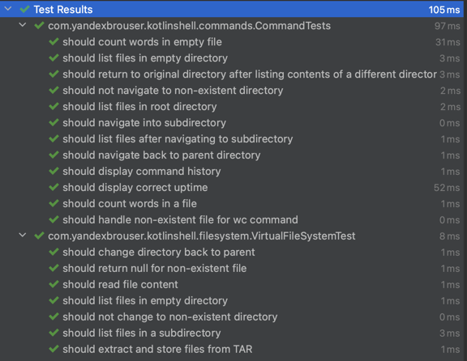

# Kotlin Shell Emulator

This project is a **Kotlin-based shell emulator** designed to mimic a session in a UNIX-like operating system's shell environment. The emulator can handle a virtual file system provided in a `.tar` format and can execute basic shell commands. It also includes a simple history and uptime tracking feature.

## Table of Contents

1. [Features](#features)
2. [Commands Supported](#commands-supported)
3. [Setup Instructions](#setup-instructions)
4. [Running the Program](#running-the-program)
5. [Example Usage](#example-usage)
6. [Tests](#tests)

## Features

- Simulates a command-line shell environment.
- Supports executing commands like `ls`, `cd`, `exit`, `wc`, `history`, and `uptime`.
- Accepts a virtual file system in the form of a `.tar` file.
- Tracks the uptime since the emulator was started.
- Records and displays command history.

## Commands Supported

The emulator supports the following commands:

1. **`ls`**:
   - Lists the files and directories in the current working directory.
   - Usage: `ls`

2. **`cd <directory>`**:
   - Changes the current working directory.
   - Supports moving to parent directories using `cd ..`.
   - Usage: `cd <directory>`

3. **`exit`**:
   - Exits the shell emulator.
   - Usage: `exit`

4. **`wc <file>`**:
   - Displays the word count of the specified file.
   - Usage: `wc <file>`

5. **`history`**:
   - Displays the history of commands executed in the current session.
   - Usage: `history`

6. **`uptime`**:
   - Displays the amount of time the emulator has been running since startup.
   - Usage: `uptime`

## Setup Instructions

### Prerequisites

- **Kotlin 1.8.x** or compatible version.
- **JDK 8** or later.
- Gradle for building and running the project.
- A virtual file system in the form of a `.tar` file.

### Dependencies

- **Apache Commons Compress** for handling `.tar` files.
- **JUnit** for unit testing.

## Running the Program

1. Clone the repository to your local machine:
   ```bash
   git clone https://github.com/your-repo/kotlin-shell-emulator.git
   ```

2. Navigate to the project directory:
   ```bash
   cd kotlin-shell-emulator
   ```

3. Build the project using Gradle:
   ```bash
   ./gradlew build
   ```

4. Run the program using the following command, providing the **computer name**, the path to the **virtual file system (tar file)**, and the **startup script**:
   ```bash
   ./gradlew run --args="MyComputer /path/to/virtualfs.tar /path/to/startupscript.sh"
   ```

   - **Computer name**: Used as the prompt in the shell.
   - **Virtual file system**: A `.tar` file containing the file system that will be used by the emulator.
   - **Startup script**: A shell script containing commands to be executed at startup.

### Example Command Line Execution

```bash
./gradlew run --args="MyComputer virtualfs.tar startscript.sh"
```

### Example Virtual File System Structure

```
virtualfs.tar
├── file1.txt
├── dir1/
│   └── file2.txt
└── dir2/
    └── file3.txt
```

## Example Usage

Once the shell emulator is started, you can use the available commands. Here’s an example session:

```bash
MyComputer> ls
file1.txt  dir1  dir2

MyComputer> cd dir1
Changed directory to: dir1

MyComputer> ls
file2.txt

MyComputer> wc file2.txt
Word count: 5

MyComputer> history
ls
cd dir1
ls
wc file2.txt

MyComputer> uptime
Uptime: 123456 milliseconds

MyComputer> exit
```

## Tests

Unit tests are available to validate the functionality of the shell emulator and the commands it supports.

To run the tests, use the following command:

```bash
./gradlew test
```

This will execute all unit tests defined in the `src/test` directory, including:
- **CommandTests**: Tests for commands such as `ls`, `cd`, `wc`, `history`, and `uptime`.
- **VirtualFileSystemTest**: Tests for the virtual file system's functionality, including file extraction, listing, and directory navigation.
# Test Results

The following screenshot shows the successful execution of the test suite:



---

### Notes:
- Ensure the tar file is correctly formatted and contains the desired files and directories.
- If any files or directories are missing, you can use `tar` to manually create a valid tar file.

---
